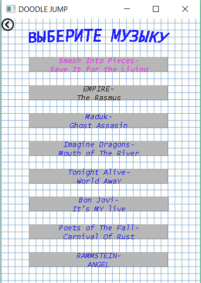

# MrDoodler
My replica of Doodle Jump

# Installation and Source Code
You can install game with static and dynamic linked libraries using appropriate installers in folders. You also can open Visual Studio 2017 project and compile code in source folders.

# Screenshots

## Main menu

## Game screen

## Settings

## Records and champions

## Audio playlist

# Anno
Yeah, code little bit messy 'cause it was one of the first my projects in university on SFML + C++
